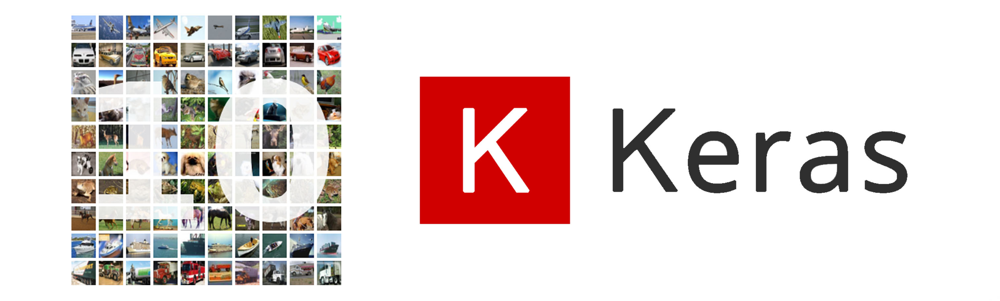
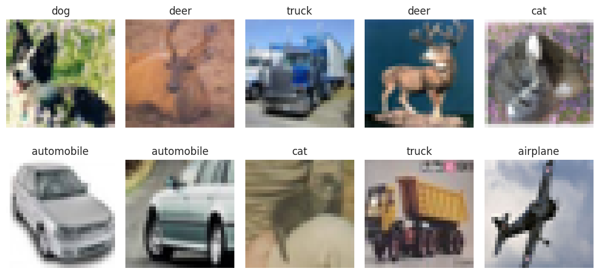
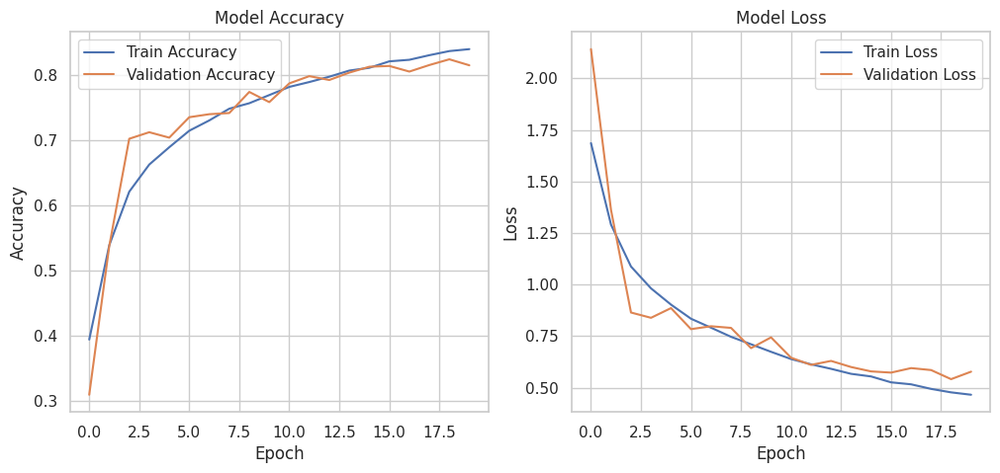
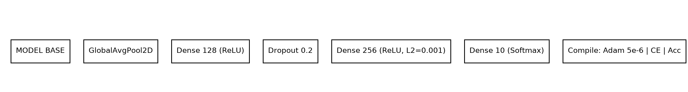
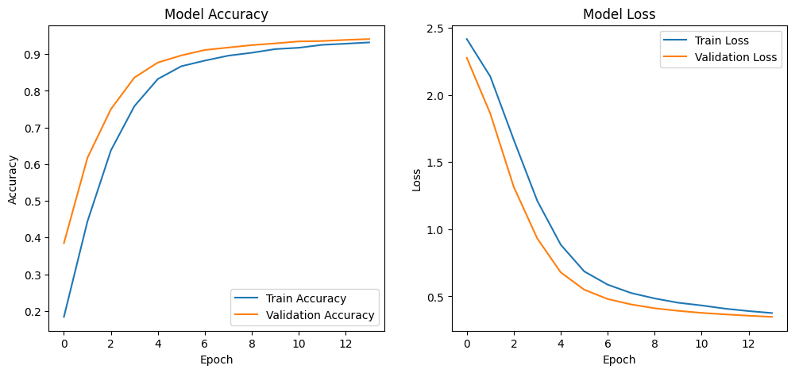

[]()
[]()
[]()
[]()
[]()

# Overview

In this project, students will first build a Convolutional Neural Network (CNN) model from scratch to classify images from a given dataset into predefined categories. Then, they will implement a transfer learning approach using a pre-trained model. Finally, students will compare the performance of the custom CNN and the transfer learning model based on evaluation metrics and analysis.

## Dataset

The dataset for this task is the CIFAR-10 dataset, which consists of 60,000 32x32 color images in 10 classes, with 6,000 images per class. You can download the dataset from [here](https://www.cs.toronto.edu/~kriz/cifar.html).

This project explores different models:

1. **EfficientNetB0**
2. **EfficientNetB2**
3. **EfficientNetB4**

We decided to use EfficientNetB4 given its ability to handle low and high image resolutions as well as having a low performance usage, so the model is not too complex nor heavy to run.

> The project is not completed and we are trying to get an improved model furthermore

## Project Description

Perhaps CIFAR-10 dataset is very clean and just a download-use dataset type, we don't needed to improve any of the images here by doing any additional process more than the resize of the images for EfficientNet.



Our project can be divided onto *2* big parts:

- CNN from Scratch
- Model Transfer

# CNN From Scratch

| Layer Type       | Parameters / Description                           | Output Shape |
|------------------|-----------------------------------------------------|--------------|
| Input            | shape = (32, 32, 3)                                 | 32×32×3      |
| Conv2D           | 32 filters, 3×3, relu, padding = same               | 32×32×32     |
| BatchNormalization | —                                                 | 32×32×32     |
| Conv2D           | 32 filters, 3×3, relu, padding = same               | 32×32×32     |
| BatchNormalization | —                                                 | 32×32×32     |
| MaxPooling2D     | 2×2                                                 | 16×16×32     |
| Dropout          | rate = 0.2                                          | 16×16×32     |
| Conv2D           | 64 filters, 3×3, relu, padding = same               | 16×16×64     |
| BatchNormalization | —                                                 | 16×16×64     |
| Conv2D           | 32 filters, 3×3, relu, padding = same               | 16×16×32     |
| BatchNormalization | —                                                 | 16×16×32     |
| MaxPooling2D     | 2×2                                                 | 8×8×32       |
| Dropout          | rate = 0.2                                          | 8×8×32       |
| Conv2D           | 128 filters, 3×3, relu, padding = same              | 8×8×128      |
| BatchNormalization | —                                                 | 8×8×128      |
| MaxPooling2D     | 2×2                                                 | 4×4×128      |
| Dropout          | rate = 0.2                                          | 4×4×128      |
| Flatten          | —                                                   | 2048         |
| Dense            | 256 units, relu                                     | 256          |
| Dropout          | rate = 0.45                                         | 256          |
| Dense            | 10 units, softmax                                   | 10           |



>88% accuracy

# Model Transfer

| Layer Type               | Parameters / Description                                | Output Shape |
|--------------------------|----------------------------------------------------------|--------------|
| base_model               | Load EfficientNetB2                                | —            |
| GlobalAveragePooling2D   | Means to 2D the 3D Tensor      | —            |
| Dense                    | 128 units, activation = relu                             | 128          |
| Dropout                  | rate = 0.2                                               | 128          |
| Dense                    | 256 units, relu, L2 = 0.001                              | 256          |
| Dense                    | 10 units, softmax                                        | 10           |





# Key Learning Points

## Data Augmentation

We can transform the iamges not only by resizing the original samples but doing some zoom, changing the gamma, the contrast, the channels, etc; so we can improve a little better the weak classes, which are in this case Cat vd Dog.

## Computational Resources

We learned that handling so much data requires so much power but a lot, so instead of just making everything on RAM, we need to learn some on-the-fly data management to avoid collapsing the collab.

## Hyperparameter

Tuning the model requires a good understanding of the metrics and the math behind it. Choosing the right answer can improve a 1%, and it is much appreciated isntead of just putting random values and trying to figure if the model will improve or not.

# Results
The final EfficientNetB2 model achieved:

| Class       | Precision | Recall | F1-score | Support |
|-------------|-----------|--------|----------|---------|
| airplane    | 0.93      | 0.87   | 0.90     | 1000    |
| automobile  | 0.93      | 0.95   | 0.94     | 1000    |
| bird        | 0.90      | 0.90   | 0.90     | 1000    |
| cat         | 0.82      | 0.82   | 0.82     | 1000    |
| deer        | 0.90      | 0.90   | 0.90     | 1000    |
| dog         | 0.86      | 0.88   | 0.87     | 1000    |
| frog        | 0.94      | 0.94   | 0.94     | 1000    |
| horse       | 0.94      | 0.92   | 0.93     | 1000    |
| ship        | 0.94      | 0.93   | 0.94     | 1000    |
| truck       | 0.90      | 0.94   | 0.92     | 1000    |

| Metric       | Precision | Recall | F1-score | Support |
|--------------|-----------|--------|----------|---------|
| accuracy     | —         | —      | 0.90     | 10000   |
| macro avg    | 0.90      | 0.90   | 0.90     | 10000   |
| weighted avg | 0.90      | 0.90   | 0.90     | 10000   |

# Future Improvements

**Weak classes:** we saw `cat vs dog` is the most common problem for our model; we can treat this with some data augmentation —most common problem solving one. But, for this, we need much computational power in order to handle all images while keeping the resized images. Simply too much even for google collab, and `I` don't have the knowledge to do some `on-the-fly` processing of data.

**CIFAR-10 image res:** We cannot do much here. The dataset is what it is, and expecting a higher results without data augmentation *wich requires a lot of computational power* would help to improve the results, but not too much using the model we're using here that also requires a lot of computational power.

**Hard samples:** We can do some focal-loss, renaming, resampling or even delete some of the samples that may confuse our model, but as we are working with tousands of samples, we are gonna need *much* more RAM.

## Project Structure
```bash
Project03_IronKaggle/
├── models/ # readme resources and baseline model
│   ├── (many images) # many images lol
├── model_training.ipynb # CNN built from scratch
├── model_transfer.ipynb # Model transfer and fine tune
├── presentation.pdf # presentation in PDF format
├── README.md # current readme <:
```

## Installation & Usage
```bash
# Clone repository
git clone https://github.com/iKebb/Project04_DeepLearning-Image_Classification.git
```

``` python
# To check the CNN built from scratch
path_model= "models/baseline_model.keras"
model= load_model(path_model)

model.predict(data)
```

To check the EfficientNetB2 model. Since the model is kind of heavy, you need to download it from drive: [TunedEfficientModelB2](https://drive.google.com/file/d/1NQrf6nsjx83ptcNIGwJH3pyy0sHY39lx/view?usp=drive_link)

```python
# To check the Transfer Model
path_model= "models/model_tune_b2.keras"
model= load_model(path_model_b2)

model.predict(data)
```
## Contributors

<table align="center">
  <tr>
    <td align="center">
      <a href="https://github.com/iKebb">
        <br>
        <sub><b>Keberth</b></sub>
      </a>
    </td>
    <td align="center">
      <a href="https://github.com/Diogobme">
        <br>
        <sub><b>Diogo</b></sub>
      </a>
    </td>
    <td align="center">
      <a href="https://github.com">
        <br>
        <sub><b>Eloisa</b></sub>
      </a>
    </td>
  </tr>
</table>

## License

This project is free of license. Feel free to use it!

## Contact

- **Via E-mail** - [keberth12@gmail.com](mailto:keberth12@gmail.com)
- **Via LinkedIn** - [Keberth José Rodríguez Albino](https://www.linkedin.com/in/keberth-josera-vkse1666)

Repo link: https://github.com/iKebb/Project04_DeepLearning-Image_Classification